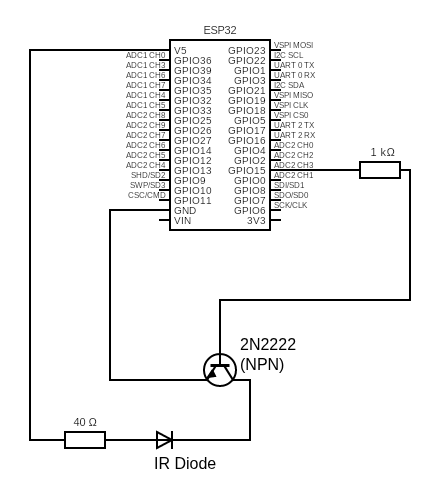

# ESP32-MCP-air-conditioner

Turn your Air Conditioner on/off and control it from a Chatbot application using this MCP server running on an ESP32 microcontroller.

[!](https://github.com/user-attachments/assets/1218c517-bfdc-407c-82f9-809421ac7438)

## Overview

This project implements a Model Context Protocol (MCP) server on an ESP32 MCU, enabling remote control of an air conditioner via chatbot or other MCP-compatible clients. The ESP32 acts as a bridge between the MCP server and the air conditioner's IR interface or relay.

## Features

- Control air conditioner power (on/off) remotely
- Integrate with chatbot applications for voice or text commands
- Runs on affordable ESP32 hardware
- Easily customizable for different AC models

## Hardware Requirements

- ESP32 development board
- IR LED or relay module (depending on AC control method)
- Optional: Breadboard, jumper wires, power supply

## Software Requirements

- Arduino IDE
- ESP32 board support installed
- ArduinoJson (install via Library Manager)
- IRremoteESP8266 (install via Library Manager)
- WiFi (built-in with ESP32 board support)
- WebServer (built-in with ESP32 board support)
- `mcp.json` configuration file

## Setup Instructions

1. **Clone this repository** to your local machine.
2. **Open `ESP32-MCP-air-conditioner.ino`** in Arduino IDE or your preferred environment.
3. **Configure your Wi-Fi credentials** and any AC-specific settings in the code.
4. **Upload the firmware** to your ESP32 board.
5. **Connect the IR LED or relay** to the appropriate ESP32 pins.
6. **Power on the ESP32** and ensure it connects to your Wi-Fi network.
7. **Integrate with your chatbot** or MCP client, pointing it to the ESP32's IP address.

## Usage

- Send commands from your chatbot or MCP client to control the air conditioner.
- Supported commands typically include power on/off, temperature set, and mode change (customize as needed).

## Circuit Diagram

Below is the circuit diagram for connecting the ESP32 to control the air conditioner:

**Explanation:**
- The circuit uses an ESP32 development board to control the AC.
- A transistor is used to drive the IR LED or relay, allowing the ESP32 to switch higher currents safely.
- An IR diode (LED) is used to emit infrared light for controlling the air conditioner via IR signals.
- The circuit includes a 40Ω resistor (for current limiting to the IR LED or relay) and a 1kΩ resistor (for the transistor base).

Refer to the diagram for exact wiring details.
